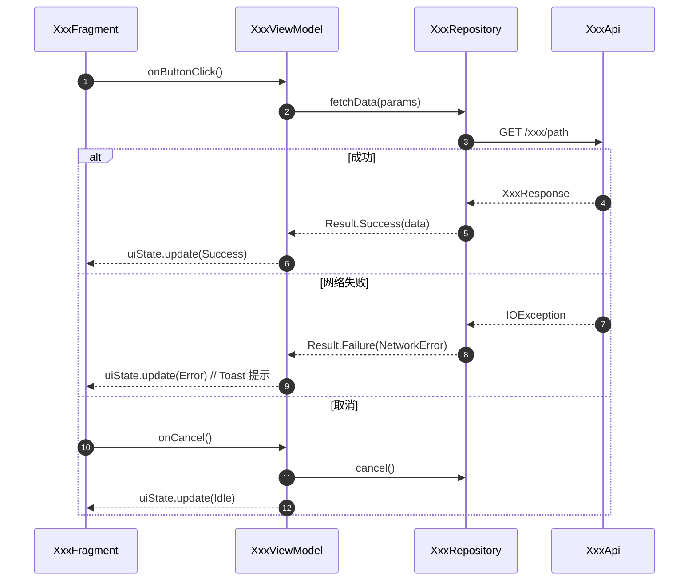

# devflow design — 技术设计

**用途：** 基于 `spec/requirement.md`（已含 Figma UI 规范和接口定义），通过 CodeGraph 计算爆炸半径，召回 Bug 经验转化为设计约束，边设计边追问技术决策，生成完整技术设计文档，确认后冻结。

---

## 前置条件

- `spec/requirement.md` 存在，且包含：背景与目标 / 功能需求 / 验收标准。
- `meta.json` 状态为 `analyzing`（合法前驱）。

不满足时输出：
```
✗ 前置条件不满足：spec/requirement.md 不存在或缺少必填章节。
  请先执行 devflow analyze 完成需求分析。
```

---

## ⚠️ 核心禁令

- ❌ 禁止擅自更改 `spec/requirement.md` 中的业务需求
- ❌ 禁止生成可直接编译/运行的完整代码（只允许伪代码/流程描述）
- ❌ 禁止忽略现有代码结构，必须分析改造成本和风险
- ❌ 禁止在编码阶段修改已冻结的设计文档，发现设计问题必须触发 `devflow change`
- ❌ 禁止使用「可能/或许/大概」等模糊表述，方案必须明确可执行
- ✅ 涉及 L0 模块时，必须强制要求人工审批，AI 只提供方案建议

**对外文档（tech-design-doc.md）附加禁令：**
- ❌ 禁止用空洞描述替代具体实现（「封装了状态管理」「统一处理异常」等写法不可接受）
- ❌ 禁止泛化章节套壳但内容为空（如「依赖的后端服务：无」这类占位节必须整节删除）
- ❌ 禁止时序图只画主流程，必须覆盖失败分支和取消分支
- ❌ 禁止待确认问题不写负责方和阻塞等级
- ❌ 禁止多语言 Key 只写「已预留」，必须列出完整 Key 表

---

## 执行步骤

### 1. 读取需求上下文

从 `spec/requirement.md` 中提取（**不重复读取 Figma 或接口文档**，analyze 阶段已完成）：

- 所有功能点列表
- UI 交互规范（来自 Figma 的页面层级、组件清单、状态机、文案）
- 接口依赖（来自 Apifox/YApi 的接口路径、字段定义、枚举值）
- 现状背景核验结论（涉及模块、需新增 vs 改造的部分）
- 验收标准

若 `spec/requirement.md` 中 UI 交互规范或接口依赖章节为空/标注「待核验」，补充读取：
- Figma：优先 Figma Desktop MCP（`get_figma_data` / `get_screenshot`），降级 Framelink MCP
- 接口：优先 YApi WebFetch，降级 Apifox MCP

#### UI / 样式改动检查

扫描功能需求，若包含以下任一信号（页面/布局/组件/样式/交互/动画/颜色/字体/间距/图标），视为涉及前端样式改动：

- `spec/requirement.md` 的「UI 交互规范」章节不为空 → 直接使用
- 章节为空或标注「待核验」，且 `artifacts/` 中无截图 → **立即追问**：

```
⚠️ 发现前端样式改动，但未找到 Figma 设计稿。
   请提供以下任一信息后继续设计：
   · Figma 链接（推荐）：https://www.figma.com/design/...
   · 设计稿截图（粘贴到对话）
   · 若沿用现有样式无变动，请确认「无样式变更」
```

收到 Figma 链接后立即用 Figma Desktop MCP 读取，补充到设计文档「UI 规范」节；收到截图则保存到 `artifacts/` 并提取可见信息；确认无样式变更则跳过。

---

### 2. Bug 经验加载（设计约束转化）

读取 `bug-experience-cards.csv`，从需求涉及的**模块名、接口名、字段名、平台**识别命中的经验卡：

命中卡的处理：

| 字段 | 转化为 |
|------|-------|
| `anti_patterns`（反模式） | 写入「设计约束」，明确在本方案中禁止出现 |
| `required_tests`（要求测试） | 写入「验证方案」中的回归场景 |

触发词参考（命中则必须载入）：

| 触发词 | 对应经验卡类型 |
|--------|------------|
| 金额/价格/精度/汇率 | 高精度类型约束，禁止浮点处理 |
| 接口/字段/枚举/空值 | 字段语义/默认值/枚举兜底 |
| 登录/Token/权限 | 登录态边界、Token 刷新竞态 |
| 异步/缓存/队列 | 幂等键、重试上限、消息乱序 |
| 灰度/开关/配置 | 正反向路径必须同时设计 |
| 状态/流程/驳回 | 全状态流，反向路径（驳回/重提交） |

未命中或知识库不可读 → 注明「未召回 Bug 经验」，继续。

---

### 3. CodeGraph 深度分析

#### 3.1 现有代码结构分析

对需求中涉及的模块/类/函数名执行：
```
codegraph_explore("<模块名 类名 接口名>")
```

提取：
- 可复用的现有组件和逻辑
- 需要改造的现有实现（改造点 + 改造原因）
- 需要新增的模块（不与现有架构冲突）

#### 3.2 爆炸半径评估

对每个**拟修改的核心符号**执行：
```
codegraph_impact  <symbol>
codegraph_explore <symbol>
```

| 直接调用方数量 | 风险等级 | 行为 |
|------------|------|------|
| 0–2 | LOW | 继续 |
| 3–10 | MEDIUM | 在「涉及模块」章节列出所有受影响模块 |
| 11–30 | HIGH | **暂停，向用户确认后继续** |
| 30+ | CRITICAL | **强制停止，必须提供更安全的替代方案** |

#### 3.3 安全策略检查

若涉及 L0 模块（`repo-classification.json` 中标注）：
- **强制要求人工审批**，AI 只输出方案建议，不得自行生成完整修改方案
- 在文档中标注 `🔒 [L0 — 需人工审批]`

---

### 4. 边设计边追问技术决策

设计过程中遇到需要决策的技术选择点时，**当场追问**，不攒到最后。

追问时机：
- 存在多种合理实现方案（如：客户端压缩 vs 服务端压缩）
- 涉及架构风格选择（如：复用现有 Repository vs 新建）
- 涉及第三方库选型（如：UCrop vs 自研裁剪）
- 涉及数据一致性策略（如：上传成功后是否刷新全局缓存）
- 涉及兼容性边界（如：旧版本 API 不支持时的降级策略）

**追问格式：**
```
⚙️ 技术决策 #{N}
  场景：{描述}
  方案 A：{描述}（优点/缺点）
  方案 B：{描述}（优点/缺点）
  建议：方案 {X}，原因：{一句话}
  请确认或选择其他方案：
```

用户确认后立即写入设计文档对应章节，标注决策来源。

---

### 5. 平台专项设计

根据项目类型（`devflow.json` 中的 `project.type`）生成对应设计文档：

#### 单平台 / 通用
生成 `spec/design.md`

#### iOS 原生界面层
生成 `spec/design_ios.md`，必须包含：
- ViewController 层级结构
- UIKit / SwiftUI 组件选型
- 生命周期与状态管理
- 安全区域、键盘顶起处理
- 与 KMP 层的接口边界（若有）

#### Android 原生界面层
生成 `spec/design_android.md`，必须包含：
- Fragment / Activity 结构
- ViewModel / LiveData / StateFlow 选型
- 生命周期处理
- 与 KMP 层的接口边界（若有）

#### KMP 共享层
生成 `spec/design_kmp.md`，必须包含：
- Presenter / UseCase / Repository 分层
- 平台无关接口定义
- 跨平台状态管理
- 与各原生层的契约（expect/actual 边界）

多平台项目可同时生成多个文件，`spec/design.md` 作为整体架构总览。

---

### 6. 接口设计与同步

#### 接口信息收集（四步优先级）

在进行接口设计前，按以下顺序收集接口信息，**每一步有结果就停止，不跳级**：

**① 优先用 `spec/requirement.md` 已有数据**

若「接口依赖」章节已有来自 YApi 的接口定义（analyze 阶段已读取），直接进入接口设计，跳过后续步骤。

**② CodeGraph 主动查询**

若需求文档中接口信息不完整，从功能需求中提取关键实体词（接口路径关键词、业务模块名、数据对象名），通过 CodeGraph 查找现有实现：

```
codegraph_explore("<模块名 数据对象名 接口路径关键词>")
```

从结果中提取：
- Repository / DataSource / ApiService 类的方法签名
- 已有的接口路径常量（如 `const val API_UPLOAD_AVATAR = "/user/avatar/upload"`）
- 请求/响应数据类的字段定义

找到后在 YApi 中验证：
```
WebFetch: https://yapi.hszq8.com/api/interface/list?project_id={pid}&limit=50
```
按路径匹配，找到则读取完整接口详情，补充到 `spec/requirement.md` 的「接口依赖」章节，标注来源 `[CodeGraph 反查]`。

**③ YApi 全局搜索**

若 CodeGraph 未找到对应实现，按功能关键词在 YApi 搜索：
```
WebFetch: https://yapi.hszq8.com/api/interface/list?project_id={pid}&limit=100
```
按接口路径或名称模糊匹配（如需求涉及「头像」，搜索 `avatar`、`profile`、`user`）。

找到则读取详情，写入 `spec/requirement.md`，标注来源 `[YApi 搜索]`；未找到则继续步骤 ④。

**④ 仍未找到时才追问**

经过 ② ③ 均未找到接口信息，再向用户追问：

```
⚠️ 已通过 CodeGraph 和 YApi 搜索，未找到「{功能点}」相关接口。
   请提供以下任一信息：
   · YApi 接口链接：https://yapi.hszq8.com/project/.../interface/api/...
   · 接口路径或名称（如：POST /user/avatar/upload）
   · 若此接口需新增，请确认「新增接口，由前端起草」或「后端已有草稿，链接：...」
```

---

#### 现有接口变更
若设计涉及对现有接口的字段新增/修改：
- 在 `spec/api.md` 中记录变更（变更前/变更后对比）
- 询问是否需要在 Apifox 中更新接口定义

#### 新增接口设计
若需要新增接口，在 `spec/api.md` 中定义：
```
方法：POST /user/avatar/upload
请求：file(binary), type(enum: jpg|png|webp)
响应：{ avatarUrl: string, updatedAt: timestamp }
错误码：400 文件格式不支持, 413 超出大小限制
```

**接口变更强制同步规则**：任何接口变更必须同步写入 `spec/api.md`，不得只在设计文档中描述而不更新接口文档。

---

### 7. 生成技术设计文档

将以上分析结果整合写入设计文档，**必须包含以下章节**：

```markdown
# 技术设计：{title}（初版）

## 一、方案目标与设计原则
- 核心问题：本方案解决什么
- 范围边界：明确不解决/不在本次范围内的内容
- 设计原则：解耦/可测试性/性能优先级等

## 二、总体架构设计
- 架构分层与各层职责
- 模块依赖关系
- 与现有架构的集成方式

## 三、核心模块设计
对每个核心模块说明：
- 模块职责（一句话）
- 对外能力（暴露的接口/方法）
- 内部实现要点（伪代码/流程描述，禁止完整代码）
- 新增 vs 改造（改造时说明改造点）

## 四、关键数据模型与数据流
- 核心数据模型（字段+类型+说明）
- 数据流转路径
- 缓存策略（若涉及）

## 五、接口变更（见 spec/api.md）
- 新增接口列表
- 变更接口列表

## 六、CodeGraph 爆炸半径评估
| 符号 | 直接调用方 | 间接调用方 | 风险等级 |
|------|-----------|-----------|---------|

最高风险等级：{LOW | MEDIUM | HIGH | CRITICAL}

## 七、Bug 经验设计约束
| 经验卡 | 问题域 | 本方案对应的强制约束 |
|--------|--------|-------------------|

## 八、风险与约束
| 风险项 | 产生原因 | 缓解方案 |
|--------|---------|---------|
🔒 L0 模块标注（若有）

## 九、回滚方案
- 出现问题时如何回滚
- 数据兼容性处理

## 十、验证方案
- 编译/构建验证命令
- 人工验收步骤（来自需求验收标准）
- 回归场景（来自 Bug 经验卡）

## 十一、⚠️ 需要评审确认的问题（若有剩余）
| 序号 | 类型 | 问题 | 可选方案 |
|------|------|------|---------|
```

---

### 8. 评审确认与文档冻结

1. 整个设计过程中已通过「边设计边追问」解决大部分决策，此步只确认剩余问题
2. 若仍有未确认项，单独列出等待用户确认，**禁止自行假设**
3. 用户全部确认后，内部设计文档标记「（最终版）」，**进入冻结状态**

**冻结规则：** 编码阶段不得修改设计文档。发现设计问题 → 停止编码 → `devflow change`。

---

### 9. 生成对外技术方案文档

内部设计文档冻结后，基于同一份内容，生成一份面向**开发/测试/产品/后端**对齐的对外技术方案文档，保存为 `spec/tech-design-doc.md`。

**定位：** 这是可以直接走查的工程文档，不是模板套壳。评审方读完需要能确切知道：改了哪里、怎么改的、调用关系是什么、异常怎么处理、谁负责什么。不写 CodeGraph 爆炸半径、Bug 经验约束、回滚方案等内部信息。

**内容密度要求（贯穿全文）：**
- 接口签名写真实 Kotlin/Java 代码，不写「封装了 XxxUtil 调用」这种描述
- 伪代码写关键逻辑（条件判断、空值处理、回调结构），不写「实现授权逻辑」
- 类名/方法名/文件路径全部精确，评审方能直接 Ctrl+F 在代码里找到
- 数字要具体：「约 5 行变动」而非「少量修改」；「现有 12 个调用方」而非「广泛使用」

**文档模板（严格按此结构生成）：**

```markdown
# {需求名称} 技术方案

## 1. 背景与目标

一句话说清为什么做，以及核心约束是什么（如合规要求、产品目标、技术债）。

**需求链接：** {PRD 链接 / Meegle 工作项链接}

---

## 2. 功能范围

### 2.1 本方案实现的功能
- {功能1}
- {功能2}

### 2.2 本方案不实现的功能（与「做什么」同等重要，防止评审扯皮）
- {功能X}：{原因，如「本期不涉及」「由后端控制」}
- {功能Y}：{澄清，容易误解的能力}

### 2.3 涉及模块

| 端 | 模块路径 | 改动性质（新增/改造/只读） |
|----|---------|--------------------------|
| 客户端 | {com.xxx.module} | {新增/改造} |
| KMP | {biz-xxx/src/...} | {无则整行删除} |

---

## 3. 整体链路与插入点

**现有链路：**
{用一段文字或伪代码描述改动前的执行路径，说清本次改动插入在哪个位置}

**改造后伪代码（说清动了哪里）：**
```
// 改造前关键路径
fun existingFlow() {
    step1()
    step2()  // ← 本次在此处插入
    step3()
}

// 改造后
fun existingFlow() {
    step1()
    newComponent.doWork()  // 新增
    step2()
    step3()
}
```

---

## 4. 调用时序图

> 使用 Mermaid，必须覆盖：主流程（成功）、失败分支、取消分支。参与方用真实类名，启用 autonumber。



---

## 5. 新增/改动文件清单

| 文件路径 | 改动性质 | 改动量估算 | 说明 |
|---------|---------|-----------|------|
| `com/xxx/XxxViewModel.kt` | 改造 | 约 30 行 | 新增状态字段和事件处理 |
| `com/xxx/XxxRepository.kt` | 改造 | 约 15 行 | 新增接口调用分支 |
| `com/xxx/NewComponent.kt` | 新增 | 约 80 行 | 封装 {职责} |
| `res/layout/fragment_xxx.xml` | 改造 | 约 20 行 | 新增 {控件名} |

---

## 6. 模块设计

> 每个新增类给出真实接口签名（不是描述），关键方法给出伪代码实现要点。

### 6.1 {新增/改造的类名}

```kotlin
// 真实接口签名
class XxxManager(
    private val repo: XxxRepository,
    private val scope: CoroutineScope
) {
    fun start(config: XxxConfig): Flow<XxxState>
    fun cancel()
    fun release()
}

data class XxxConfig(
    val userId: String,
    val mode: XxxMode  // enum: NORMAL, RETRY
)
```

**`start()` 关键逻辑：**
```
fun start(config):
    if config.userId is empty → emit Error(INVALID_PARAM)
    launch coroutine:
        emit Loading
        result = repo.fetch(config)
        if result is Success → emit Success(result.data)
        if result is Failure(NetworkError) → emit Error(NETWORK), retry 最多 1 次
        if result is Failure(other) → emit Error(UNKNOWN)
```

### 6.2 {下一个类}

...

---

## 7. 数据流

从触发到结束的完整链路，说清内存/网络/缓存的边界：

```
用户点击 → XxxFragment.onButtonClick()
  → XxxViewModel.handleEvent(Click)
  → XxxRepository.fetchXxx(params)          ← 网络边界
      → XxxApi.getXxx()                     ← HTTP GET /xxx/path
      ← XxxResponse (内存，不持久化)
  → 映射为 XxxUiState.Content
  → StateFlow 通知 Fragment 渲染             ← 内存边界，不跨进程
```

---

## 8. 接口依赖

| 接口 | 路径 | 触发时机 | 变更说明 | 后端配合项 | 灰度前阻塞 |
|------|------|---------|---------|-----------|-----------|
| 获取 Xxx | GET /api/xxx | 页面初始化 | 新增 `mode` 字段（枚举：A/B） | 需后端新增字段支持 | 是 |
| 提交 Xxx | POST /api/xxx/submit | 用户确认操作 | 无变更 | 无 | 否 |

---

## 9. 多语言文案 Key 表

> 命名规范：`{模块名}_{功能}_{描述}`，如 `order_cancel_confirm_title`

| Key | 中文 | English | 繁體中文 | 备注 |
|-----|------|---------|---------|------|
| `xxx_dialog_title` | 确认操作 | Confirm | 確認操作 | |
| `xxx_error_network` | 网络异常，请重试 | Network error, please retry | 網絡異常，請重試 | |
| `xxx_button_confirm` | 确认 | Confirm | 確認 | ⏳ 繁体待补充 |

---

## 10. 埋点方案

| event_id | 触发时机 | 属性名 | 类型 | 枚举值/说明 |
|---------|---------|--------|------|------------|
| `xxx_page_view` | 页面曝光 | `page_source` | String | `home` / `detail` / `search` |
| `xxx_button_click` | 点击确认按钮 | `button_type` | String | `confirm` / `cancel` |
| `xxx_result` | 操作完成 | `result` | String | `success` / `fail` |
| | | `fail_reason` | String | `network` / `param_invalid` / `unknown` |

---

## 11. 异常处理

| 场景 | 触发条件 | 处理方式（具体到 UI 行为） |
|------|---------|--------------------------|
| 网络异常 | IOException / 超时 | Toast「网络异常，请重试」，弹窗保留不关闭 |
| 服务端 5xx | HTTP 500-599 | Toast「服务繁忙，请稍后重试」 |
| 参数校验失败 | userId 为空 | 直接返回，不发起请求，记录日志 |
| 空数据 | 接口返回空列表 | 展示空态视图（{具体空态文案 Key}） |
| 取消操作 | 用户主动取消 | 弹窗关闭，不触发埋点，ViewModel 重置为 Idle |

---

## 12. 测试验收清单

| AC编号 | 操作步骤 | 预期结果 |
|--------|---------|---------|
| AC-01 | 正常网络下进入页面 | {N} 秒内加载完成，展示 {具体内容} |
| AC-02 | 关闭网络后点击确认 | Toast 提示「网络异常，请重试」，弹窗不关闭 |
| AC-03 | 接口返回空列表 | 展示空态视图，文案为「{具体文案}」 |
| AC-04 | 用户点击取消 | 弹窗关闭，页面状态还原，无 Toast |
| AC-05 | {其他验收场景} | {预期结果} |

---

## 13. 待确认问题

| 负责方 | 问题描述 | 灰度前阻塞 |
|--------|---------|-----------|
| 后端 | `mode` 字段枚举值是否支持 `RETRY` 模式，当前文档未说明 | 是 |
| 产品 | 取消操作是否需要二次确认弹窗 | 否 |
| 测试 | AC-03 空态场景的具体文案是否已有设计稿 | 否 |
```

**填写规则：**
- 所有「若涉及」的节，不涉及时整节删除，不留空节占位
- 第 9 章多语言 Key 表：无多语言需求时整节删除；有则必须列全，不得只写「已预留」
- 第 10 章埋点：无埋点需求时整节删除；有则必须给出完整表格含属性和枚举值
- 第 13 章待确认问题：无待确认项时整节删除；有则必须填写负责方和阻塞等级，两列缺一不可

---

### 11. Context Checkpoint

写入 `progress.md`：
- 核心架构决策摘要
- 爆炸半径最高风险等级
- 命中的 Bug 经验约束列表
- 平台专项设计文件路径

更新 `meta.json`：`status → designing`，`stages.designed = true`，`codegraphMaxRisk = {最高等级}`。

---

### 12. 可选：Meegle 同步

若 `meta.json.linkedMeegleId` 存在，将设计摘要以评论同步到 Meegle 工作项：
```bash
meegle comment add --work-item-id <id> \
  --content "🔧 技术设计完成\n\n架构：{一句话}\n最高风险：{等级}\nL0 模块：{有/无}\n\n> 由 DevFlow 自动同步"
```

---

## 输出

```
✅ 技术设计完成，文档已落盘（已冻结）。
  内部设计文档：{spec/design.md | 含平台专项 design_ios/android/kmp.md}
  对外技术方案：spec/tech-design-doc.md
  最高风险等级：{LOW | MEDIUM | HIGH | CRITICAL}
  涉及符号：{n} 个
  L0 模块：{有，需人工审批 | 无}
  Bug 经验约束：{n} 条
  接口变更：{已同步到 spec/api.md | 无}
  技术决策：{n} 个已在设计过程中确认
  Meegle 同步：{已同步 | 未配置}

下一步：使用 `devflow estimate` 或 `devflow plan`。
```
